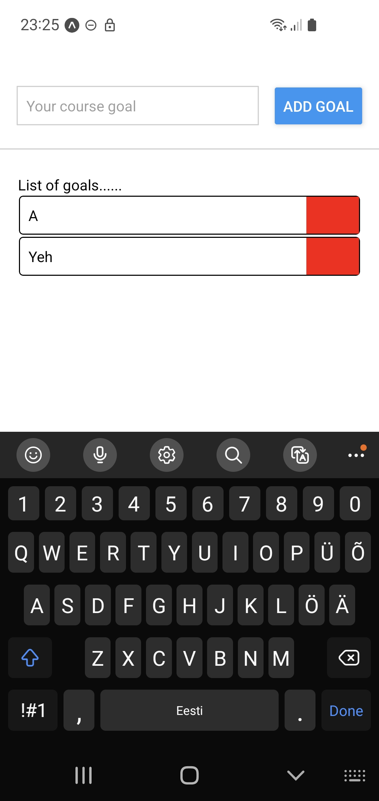
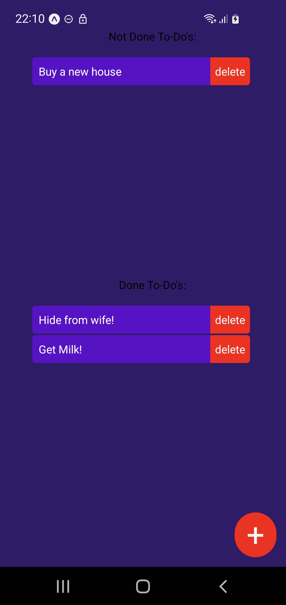

# React Native course

## Project Description

Following react native cours while creating simple todo projects etc.

### Tech Stack:

- **Frontend**: React Native

## Table of Contents

- [How to Run the Project](#how-to-run-the-project)
  - [Run Locally](#run-locally)
- [Screenshots](#screenshots)
- [Usage](#usage)
- [Contributing](#contributing)
- [License](#license)
- [Contact](#contact)

## How to Run the Project

### Run Locally

To run the project locally, follow these steps:

#### Prerequisites

- Node.js and npm installed

#### Steps

1. **Clone the repository**:

   ```bash
   git clone https://github.com/The-Estonian/react_native
   cd react_native
   cd RNCourse
   ```

2. **Run the following commends to start the development server**:

   ```bash
   npm install
   npm start
   ```

You need to be in the same local network as developemnt PC (wifi) and install Expo Go on your mobile app. After that is done you need to scan the QR code in the terminal provided. This connects your phone to the development server and you can see the changes real time.

## Screenshots

Here's screenshots of the project:

<div style="display: flex; gap: 10px;">
  
  
</div>


## Contributing

We welcome contributions! Please contact one of the authors in discord if you would like to contribute to future projects.

## License

This project is licensed under the MIT License. See the [LICENSE](https://opensource.org/license/mit) file for details.

## Contact

For any questions or suggestions, feel free to contact us directly at `Kood / Jõhvi Discord`.

## Nota Bene

The project is still a work in progress, has some bugs and could also hold more simple games in the future with some new minor bugs.

_Authors: [Jaanus Saar](https://01.kood.tech/git/jsaar)_

```

```
